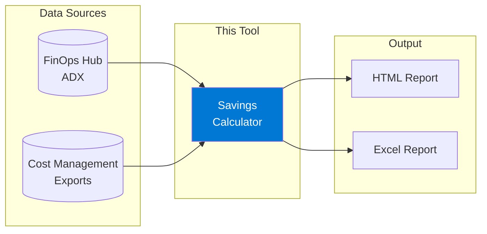
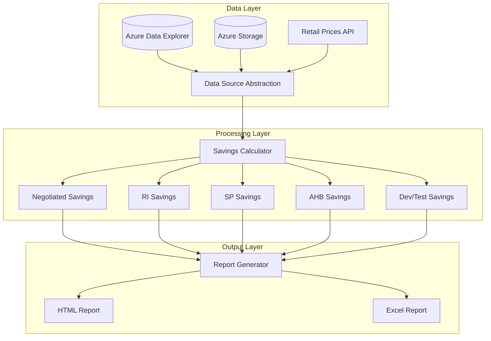

# Azure Savings Realization Report Generator

A lightweight, open-source tool to generate comprehensive Azure savings reports for customers, demonstrating the value of their MACC/ACD agreements and optimization strategies.

[](https://www.python.org/downloads/)
[](LICENSE)

## The Problem

Customers need transparency to understand how their Azure commitment and optimization strategies deliver tangible value. Today, the Azure portal provides pieces of this information across multiple views:

- Cost Analysis
- Price Sheets  
- Advisor Workbooks
- Reservation Details
- Savings Plan Reports

**But there is no single report that stitches this together end-to-end.**

## The Solution

This tool consolidates fragmented cost data into a single, customer-ready savings report.



## What This Report Shows

| Savings Category | Description | Typical Savings |
|-----------------|-------------|-----------------|
| **Negotiated Discount** | Retail (List) Price vs EA/MCA Negotiated Price | 5-15% |
| **Reserved Instances** | 1-year or 3-year compute reservations | 30-72% |
| **Savings Plans** | Flexible compute commitment | Up to 65% |
| **Azure Hybrid Benefit** | Windows/SQL Server license savings | 40-55% |
| **Dev/Test Pricing** | Dev/Test subscription discounts | ~40% |

## Quick Start

```powershell
# 1. Install dependencies
pip install -r requirements.txt

# 2. Configure your data source
Copy-Item config.example.yaml config.yaml
# Edit config.yaml with your ADX cluster or storage account details

# 3. Test connection
python generate_report.py test-connection

# 4. Generate report
python generate_report.py generate --customer "Contoso" --months 3
```

## Architecture



## Report Sections

### 1. Executive Summary
- Total spend vs what would have been paid at retail
- Total realized savings (absolute and percentage)
- Savings breakdown pie chart

### 2. Savings by Category
- Negotiated Discount Analysis
- Reserved Instance coverage and savings
- Savings Plan coverage and savings
- Azure Hybrid Benefit usage
- Dev/Test pricing savings

### 3. Detailed Analysis
- Savings by Service Category
- Savings by Subscription
- Monthly Trend Charts
- Top Resources by Savings

## Sample Output

```
┌────────────────────────────────────────────────────┐
│  Azure Savings Report - Contoso Corporation        │
│  Period: Sep 1, 2025 - Dec 1, 2025                │
├────────────────────────────────────────────────────┤
│  Retail Cost:      $1,250,000                     │
│  Effective Cost:   $875,000                       │
│  Total Savings:    $375,000 (30%)                 │
├────────────────────────────────────────────────────┤
│  Breakdown:                                        │
│  ├─ Negotiated Discount:  $125,000  (33%)         │
│  ├─ Reserved Instances:   $150,000  (40%)         │
│  ├─ Savings Plans:        $50,000   (13%)         │
│  ├─ Azure Hybrid Benefit: $40,000   (11%)         │
│  └─ Dev/Test Pricing:     $10,000   (3%)          │
└────────────────────────────────────────────────────┘
```

## Project Structure

```
azure-savings-report/
├── README.md                    # This file
├── requirements.txt             # Python dependencies (~8 packages)
├── config.example.yaml          # Configuration template
├── generate_report.py           # CLI entry point
├── src/
│   ├── __init__.py
│   ├── data_sources.py          # ADX & Storage connectors
│   ├── savings_calculator.py    # Savings calculation logic
│   ├── report_generator.py      # HTML & Excel generation
│   └── kql_queries.py           # Pre-built KQL queries
├── dashboards/
│   └── adx_dashboard.kql        # ADX dashboard queries
└── docs/
    ├── ARCHITECTURE.md          # Technical architecture
    └── USER_GUIDE.md            # Detailed usage guide
```

## Data Sources

### Option A: Azure Data Explorer (Recommended)
If you're using FinOps Hubs with ADX, the tool queries the `Costs` and `Prices` tables directly using KQL.

### Option B: Storage Account
If you have Cost Management exports (FOCUS format) to storage, point the tool to your container.

## Documentation

- **[Architecture Guide](docs/ARCHITECTURE.md)** - Technical design with Mermaid diagrams
- **[User Guide](docs/USER_GUIDE.md)** - Step-by-step usage instructions

## Why Not Use FinOps Toolkit?

| FinOps Toolkit | This Tool |
|---------------|-----------|
| Many dependencies and components | ~8 Python packages |
| Complex setup with multiple Azure resources | Single CLI tool |
| PowerBI/ADX dashboards with learning curve | Customer-ready HTML reports |
| Full FinOps platform | Focused on savings reports |

This tool is designed to **do one thing well**: generate savings realization reports for customer presentations.

## Requirements

- Python 3.9+
- Azure CLI (for authentication)
- Access to FinOps Hub ADX database OR Cost Management exports

## License

MIT License - Use freely for your customers
