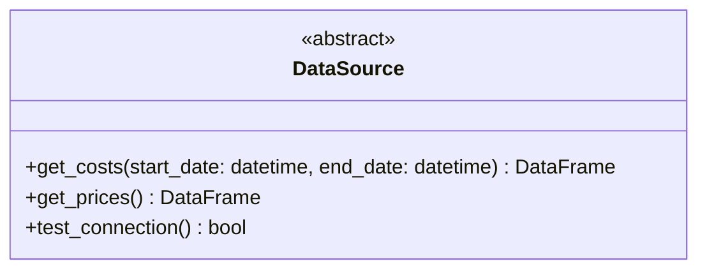
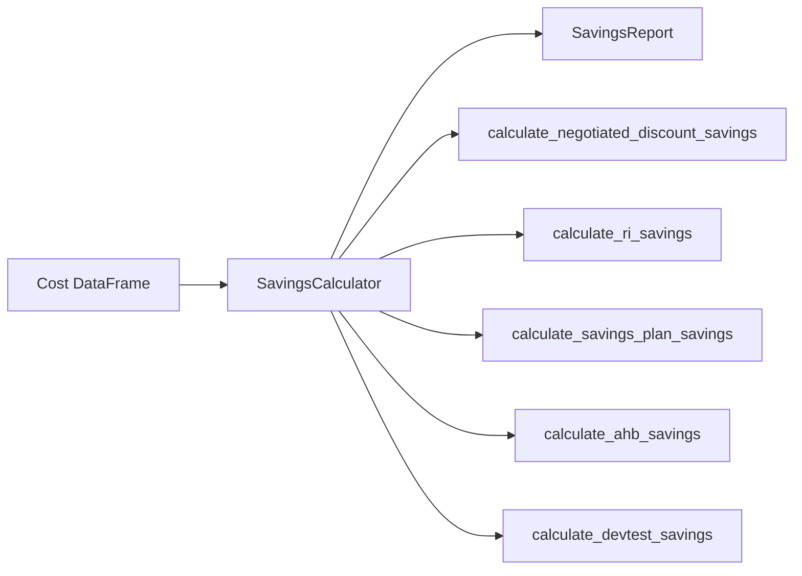
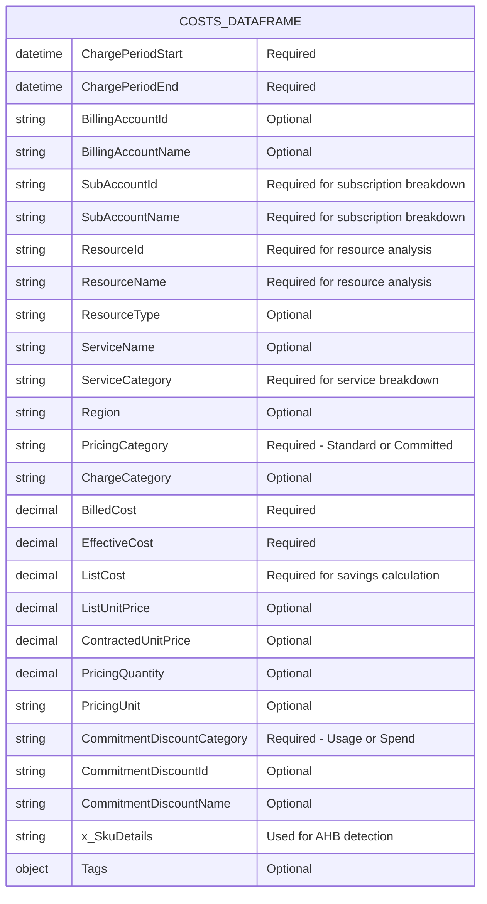

# Azure Savings Realization Report - API Reference

## Overview

This document provides detailed API reference for developers who want to extend or integrate with the Azure Savings Report tool.

---

## Module: `data_sources`

### Class: DataSource (Abstract)

Base class for all data sources. Implement this to add new data source types.



#### Methods

| Method | Parameters | Returns | Description |
|--------|------------|---------|-------------|
| `get_costs()` | `start_date`, `end_date` | `pd.DataFrame` | Retrieve cost data for date range |
| `get_prices()` | None | `pd.DataFrame` | Retrieve price sheet data |
| `test_connection()` | None | `bool` | Test data source connectivity |

---

### Class: ADXDataSource

Connects to Azure Data Explorer (FinOps Hub).

```python
from src.data_sources import ADXDataSource

ds = ADXDataSource(
    cluster_uri="https://cluster.region.kusto.windows.net",
    database="finopshub",
    costs_table="Costs",      # Optional, default: "Costs"
    prices_table="Prices"     # Optional, default: "Prices"
)
```

#### Constructor Parameters

| Parameter | Type | Required | Default | Description |
|-----------|------|----------|---------|-------------|
| `cluster_uri` | str | Yes | - | ADX cluster URI |
| `database` | str | Yes | - | Database name |
| `costs_table` | str | No | "Costs" | Costs table name |
| `prices_table` | str | No | "Prices" | Prices table name |

#### Additional Methods

| Method | Parameters | Returns | Description |
|--------|------------|---------|-------------|
| `get_savings_summary()` | `start_date`, `end_date` | `pd.DataFrame` | Pre-aggregated savings by category |

---

### Class: StorageDataSource

Connects to Azure Storage (Cost Management exports).

```python
from src.data_sources import StorageDataSource

ds = StorageDataSource(
    account_name="mystorageaccount",
    container_name="exports",
    export_path="focuscost/subscriptions/..."
)
```

#### Constructor Parameters

| Parameter | Type | Required | Description |
|-----------|------|----------|-------------|
| `account_name` | str | Yes | Storage account name |
| `container_name` | str | Yes | Blob container name |
| `export_path` | str | Yes | Path to FOCUS exports |

---

### Class: RetailPricesAPI

Query Azure Retail Prices API for comparison.

```python
from src.data_sources import RetailPricesAPI

api = RetailPricesAPI(
    cache_enabled=True,
    cache_ttl_hours=24
)

# Get single price
price = api.get_retail_price("sku-id", region="eastus")

# Get bulk prices
prices_df = api.get_prices_bulk(service_family="Compute", region="eastus")
```

---

### Factory Function: create_data_source

```python
from src.data_sources import create_data_source

# From config dict
config = {
    "data_source": {
        "type": "adx",
        "adx": {
            "cluster_uri": "https://...",
            "database": "finopshub"
        }
    }
}

ds = create_data_source(config)
```

---

## Module: `savings_calculator`

### Class: SavingsCalculator

Calculates savings from cost data.



```python
from src.savings_calculator import SavingsCalculator

calculator = SavingsCalculator(
    costs_df=costs_dataframe,
    prices_df=prices_dataframe  # Optional
)

# Generate full report
report = calculator.generate_report(
    customer_name="Contoso",
    start_date=datetime(2025, 9, 1),
    end_date=datetime(2025, 12, 1),
    currency="USD"
)
```

#### Methods

| Method | Returns | Description |
|--------|---------|-------------|
| `calculate_negotiated_discount_savings()` | `SavingsSummary` | EA/MCA discount savings |
| `calculate_ri_savings()` | `SavingsSummary` | Reserved Instance savings |
| `calculate_savings_plan_savings()` | `SavingsSummary` | Savings Plan savings |
| `calculate_ahb_savings()` | `SavingsSummary` | Azure Hybrid Benefit savings |
| `calculate_devtest_savings()` | `SavingsSummary` | Dev/Test pricing savings |
| `calculate_savings_by_service()` | `pd.DataFrame` | Breakdown by service |
| `calculate_savings_by_subscription()` | `pd.DataFrame` | Breakdown by subscription |
| `calculate_monthly_trend()` | `pd.DataFrame` | Monthly trend data |
| `calculate_top_savings_resources()` | `pd.DataFrame` | Top N resources by savings |
| `generate_report()` | `SavingsReport` | Complete report object |

---

### Dataclass: SavingsSummary

```python
@dataclass
class SavingsSummary:
    category: str              # e.g., "Reserved Instances"
    retail_cost: float         # ListCost total
    negotiated_cost: float     # BilledCost total
    effective_cost: float      # EffectiveCost total
    negotiated_savings: float  # retail - negotiated
    commitment_savings: float  # negotiated - effective
    total_savings: float       # retail - effective
    savings_percentage: float  # (total_savings / retail) * 100
```

---

### Dataclass: SavingsReport

```python
@dataclass
class SavingsReport:
    # Metadata
    customer_name: str
    report_period_start: datetime
    report_period_end: datetime
    currency: str
    
    # Totals
    total_retail_cost: float
    total_negotiated_cost: float
    total_effective_cost: float
    total_savings: float
    total_savings_percentage: float
    
    # Category breakdowns
    negotiated_discount_savings: SavingsSummary
    reserved_instance_savings: SavingsSummary
    savings_plan_savings: SavingsSummary
    ahb_savings: SavingsSummary
    devtest_savings: SavingsSummary
    
    # Detail DataFrames
    savings_by_service: pd.DataFrame
    savings_by_subscription: pd.DataFrame
    monthly_trend: pd.DataFrame
    top_savings_resources: pd.DataFrame
```

---

## Module: `report_generator`

### Class: ReportGenerator

Generates HTML and Excel reports.

```python
from src.report_generator import ReportGenerator

generator = ReportGenerator(output_dir="./reports")

# Generate HTML
html_path = generator.generate_html_report(report)

# Generate Excel
excel_path = generator.generate_excel_report(report)
```

#### Constructor Parameters

| Parameter | Type | Required | Default | Description |
|-----------|------|----------|---------|-------------|
| `output_dir` | str | No | "./reports" | Output directory |

#### Methods

| Method | Parameters | Returns | Description |
|--------|------------|---------|-------------|
| `generate_html_report()` | `report: SavingsReport` | `str` | File path to HTML report |
| `generate_excel_report()` | `report: SavingsReport` | `str` | File path to Excel workbook |

---

## Module: `kql_queries`

Pre-built KQL queries for ADX.

```python
from src.kql_queries import QUERIES, format_query

# Available queries
print(QUERIES.keys())
# dict_keys(['savings_summary', 'savings_by_service', 'monthly_trend', 
#            'ri_utilization', 'sp_utilization', 'ahb_savings', 
#            'price_comparison', 'subscription_savings', 'top_resources'])

# Format query with dates
query = format_query(
    QUERIES['savings_summary'],
    start_date='2025-09-01',
    end_date='2025-12-01'
)
```

### Available Queries

| Query Name | Description |
|------------|-------------|
| `savings_summary` | Overall savings by category |
| `savings_by_service` | Breakdown by service category |
| `monthly_trend` | Month-over-month trend |
| `ri_utilization` | Reserved Instance details |
| `sp_utilization` | Savings Plan details |
| `ahb_savings` | Azure Hybrid Benefit analysis |
| `price_comparison` | Retail vs negotiated prices |
| `subscription_savings` | Breakdown by subscription |
| `top_resources` | Top resources by savings |

---

## Complete Example

```python
"""
Complete example: Generate a savings report programmatically
"""

from datetime import datetime, timedelta
import yaml

from src import (
    create_data_source,
    SavingsCalculator,
    ReportGenerator
)

def generate_customer_report(
    customer_name: str,
    months: int = 3,
    config_path: str = "config.yaml"
) -> dict:
    """
    Generate a complete savings report for a customer.
    
    Args:
        customer_name: Name for the report
        months: Number of months to analyze
        config_path: Path to configuration file
    
    Returns:
        dict with file paths and summary data
    """
    
    # Load configuration
    with open(config_path) as f:
        config = yaml.safe_load(f)
    
    # Calculate date range
    end_date = datetime.now()
    start_date = end_date - timedelta(days=months * 30)
    
    # Connect to data source
    data_source = create_data_source(config)
    
    if not data_source.test_connection():
        raise ConnectionError("Failed to connect to data source")
    
    # Fetch cost data
    costs_df = data_source.get_costs(start_date, end_date)
    
    if costs_df.empty:
        raise ValueError("No cost data found for the specified period")
    
    # Fetch price data (optional)
    try:
        prices_df = data_source.get_prices()
    except Exception:
        prices_df = None
    
    # Calculate savings
    calculator = SavingsCalculator(costs_df, prices_df)
    report = calculator.generate_report(
        customer_name=customer_name,
        start_date=start_date,
        end_date=end_date,
        currency=config.get('report', {}).get('currency', 'USD')
    )
    
    # Generate outputs
    output_dir = config.get('report', {}).get('output_dir', './reports')
    generator = ReportGenerator(output_dir)
    
    html_path = generator.generate_html_report(report)
    excel_path = generator.generate_excel_report(report)
    
    return {
        'html_report': html_path,
        'excel_report': excel_path,
        'summary': {
            'total_retail_cost': report.total_retail_cost,
            'total_effective_cost': report.total_effective_cost,
            'total_savings': report.total_savings,
            'savings_percentage': report.total_savings_percentage
        }
    }


if __name__ == "__main__":
    result = generate_customer_report("Contoso Corporation", months=3)
    print(f"HTML Report: {result['html_report']}")
    print(f"Excel Report: {result['excel_report']}")
    print(f"Total Savings: ${result['summary']['total_savings']:,.2f}")
```

---

## Data Schema Reference

### Expected Cost DataFrame Columns (FOCUS Schema)



### Column Mapping

If your data source uses different column names, map them before passing to the calculator:

```python
# Example column mapping
column_mapping = {
    'UsageDate': 'ChargePeriodStart',
    'SubscriptionId': 'SubAccountId',
    'SubscriptionName': 'SubAccountName',
    'MeterCategory': 'ServiceCategory',
    'PreTaxCost': 'BilledCost',
    'PayGPrice': 'ListCost'
}

costs_df = costs_df.rename(columns=column_mapping)
```
