# Azure Savings Realization Report - Architecture Documentation

## Overview

The Azure Savings Realization Report Generator is a lightweight, open-source tool designed to provide customers with comprehensive visibility into their Azure cost savings. It consolidates fragmented cost data from Azure Cost Management into a single, unified report that demonstrates the tangible value of:

- Enterprise Agreement (EA) / Microsoft Customer Agreement (MCA) negotiated pricing
- Azure Hybrid Benefit (AHB) for Windows and SQL Server
- Dev/Test subscription pricing
- Reserved Instances (RI)
- Savings Plans

## Problem Statement

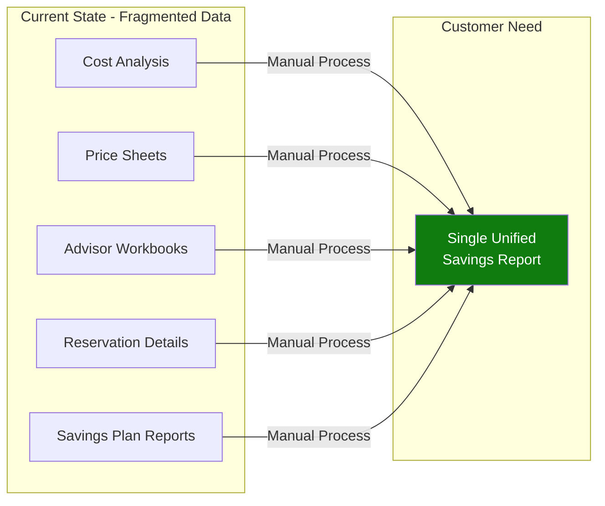

**The Gap**: Azure portal provides pieces of savings information across multiple views, but there is no single report that stitches together the complete savings story for customers.

## Solution Architecture

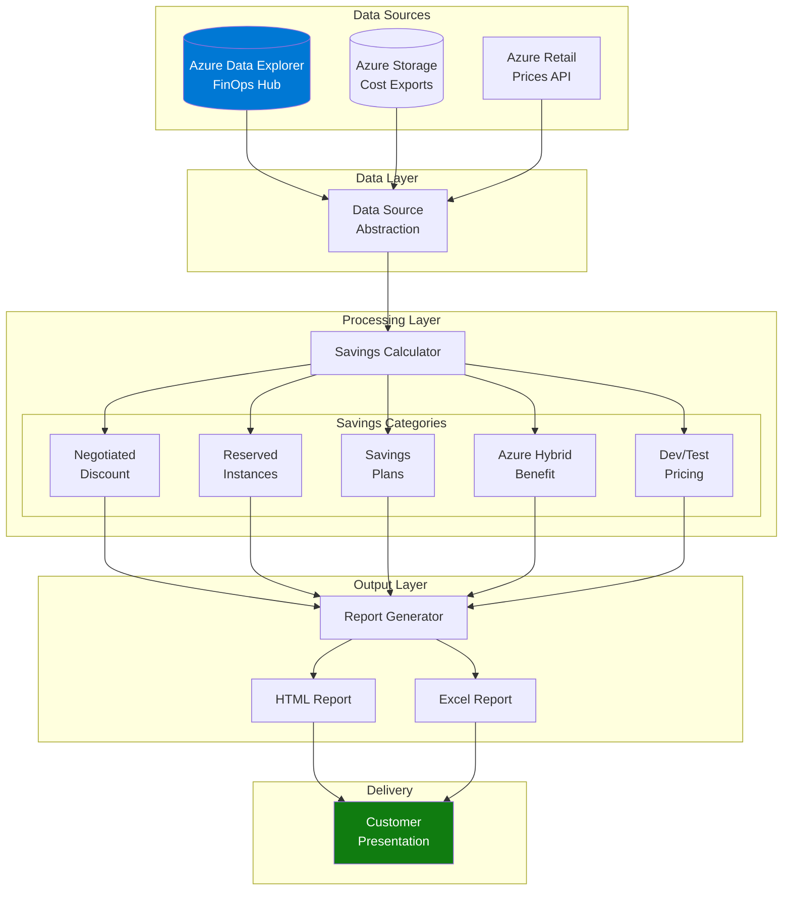

## Component Details

### 1. Data Sources

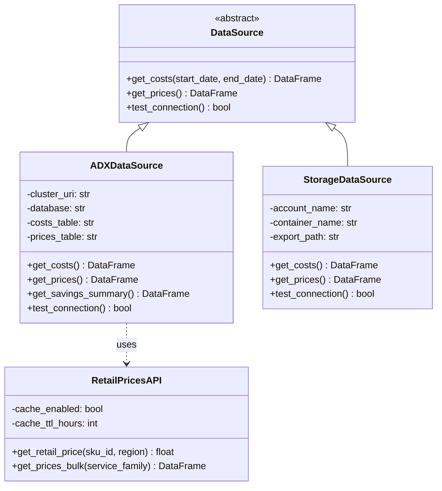

### 2. Data Flow

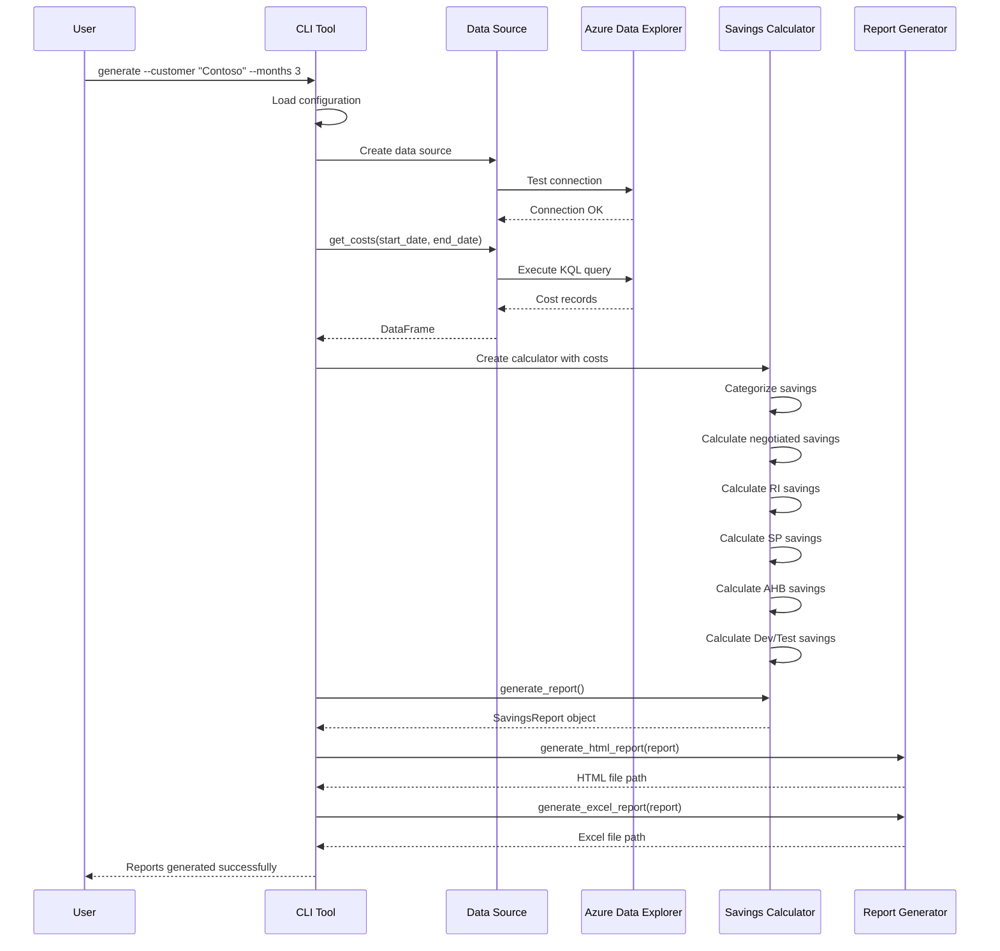

### 3. Savings Calculation Logic

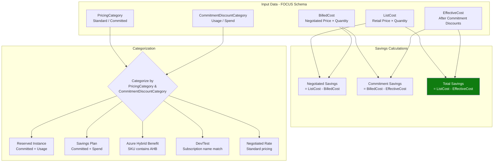

### 4. Report Structure

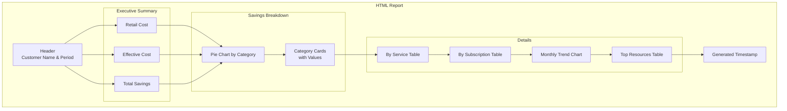

## FOCUS Data Schema

The tool relies on the **FinOps Open Cost and Usage Specification (FOCUS)** schema for standardized cost data:

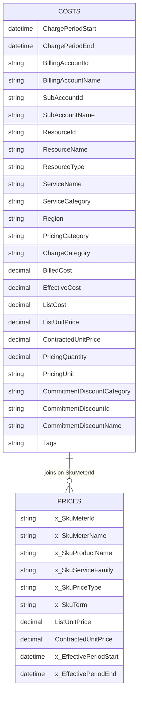

## Key Cost Fields Explained

| Field | Description | Used For |
|-------|-------------|----------|
| `ListCost` | Retail/public price × quantity | Calculating what customer would pay without any discounts |
| `BilledCost` | Negotiated EA/MCA price × quantity | Actual invoice amount before commitment discounts |
| `EffectiveCost` | Cost after RI/SP benefits applied | True cost after all discounts |
| `PricingCategory` | "Standard" or "Committed" | Identifying commitment discount usage |
| `CommitmentDiscountCategory` | "Usage" (RI) or "Spend" (SP) | Distinguishing RI vs Savings Plan |
| `ListUnitPrice` | Per-unit retail price | Price comparison analysis |
| `ContractedUnitPrice` | Per-unit negotiated price | Negotiated discount calculation |

## Deployment Options

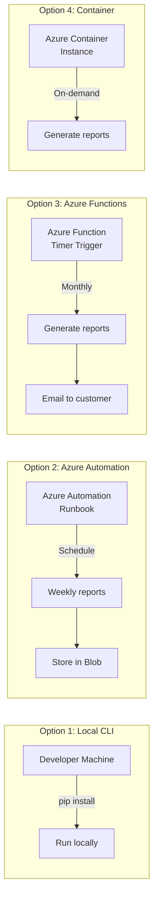

## Security Considerations

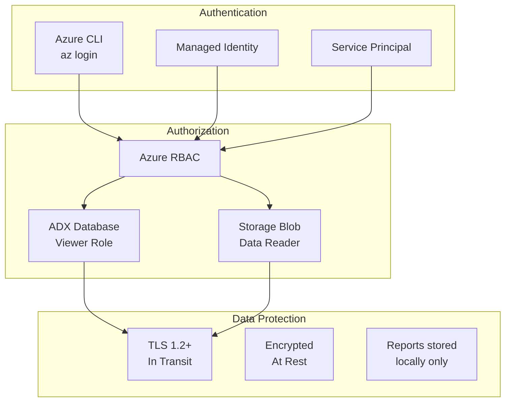

## Integration with FinOps Hub

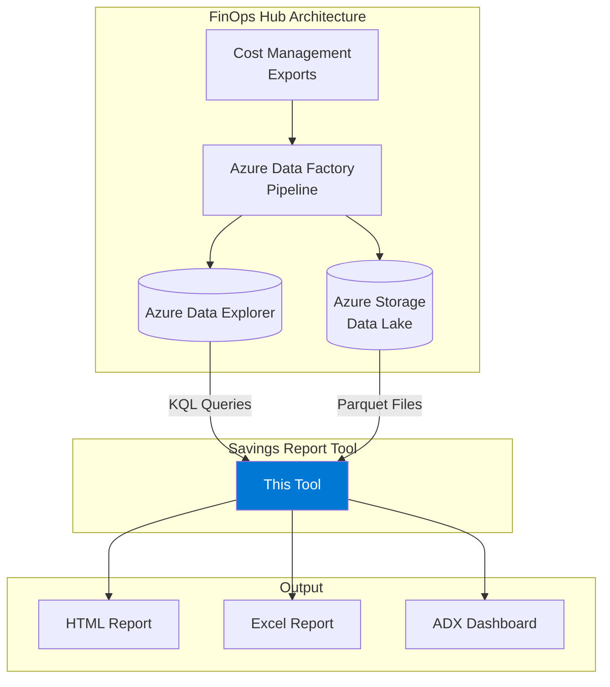

## Error Handling

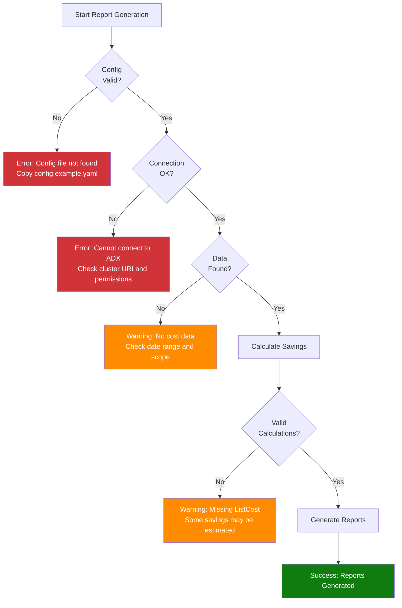

## Future Enhancements

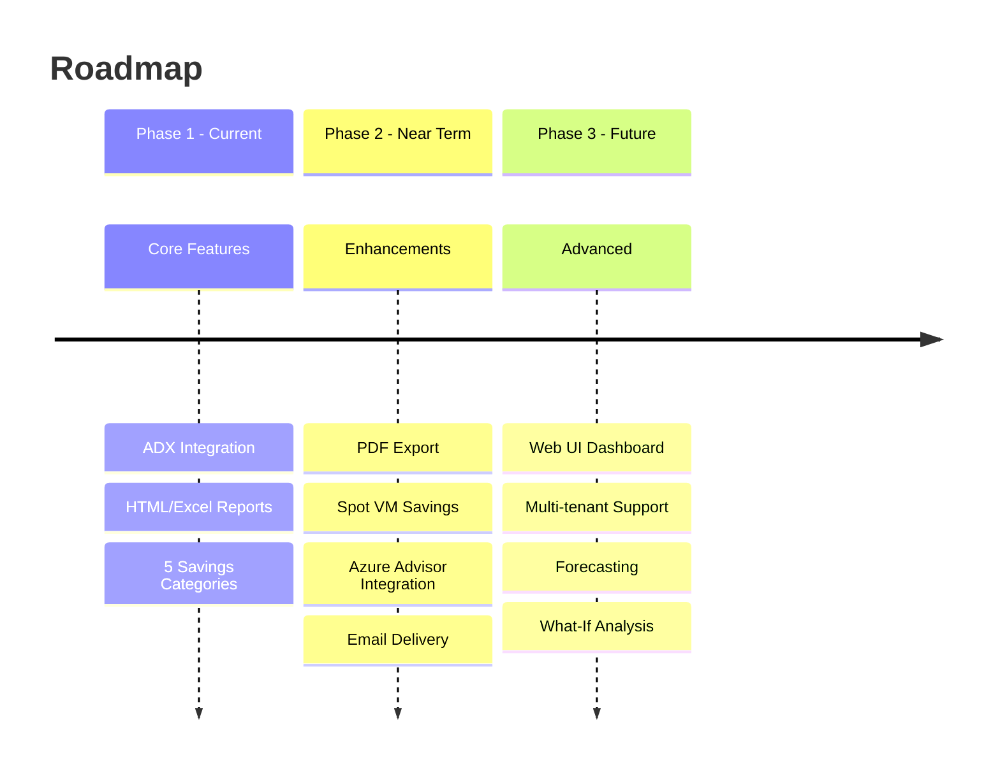

## Summary

This tool provides a **simple, focused solution** to a real customer pain point: demonstrating the value of their Azure investments. Unlike the full FinOps Toolkit which has many dependencies and complexity, this tool:

- **Does one thing well**: Generates savings realization reports
- **Minimal dependencies**: ~8 Python packages
- **Works with existing infrastructure**: Uses your FinOps Hub ADX database
- **Customer-ready output**: Professional HTML reports with charts
- **Open source**: Extend and customize as needed
