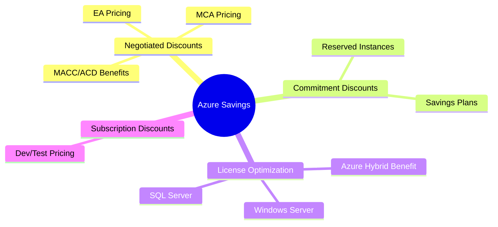
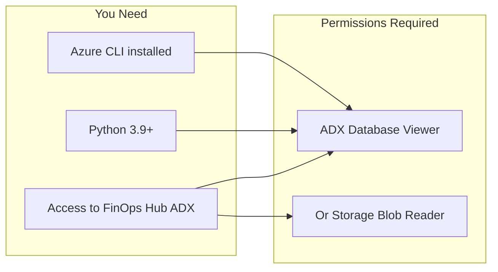
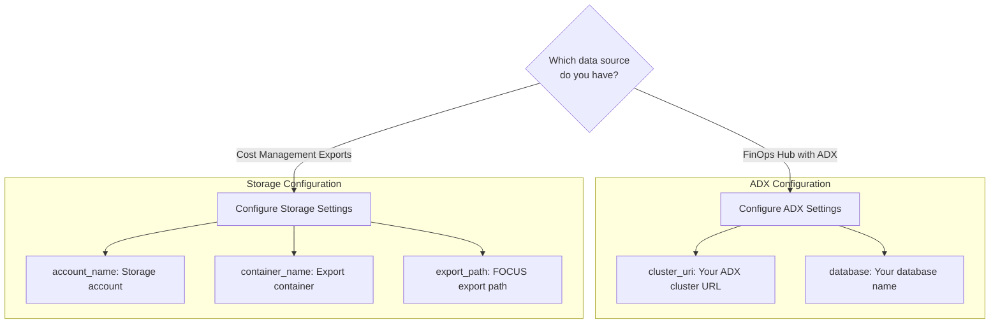
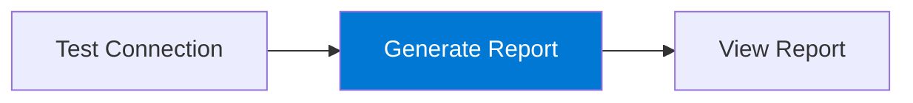
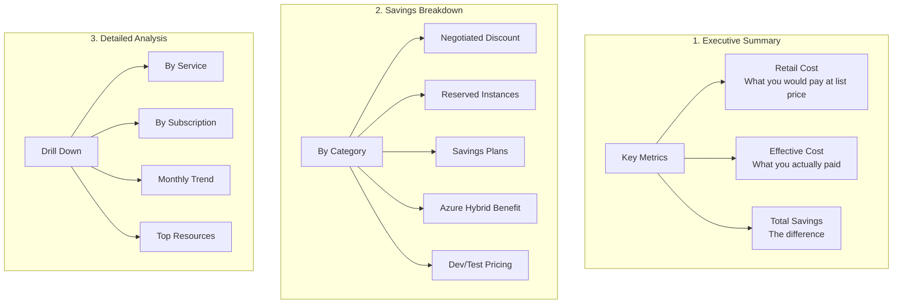
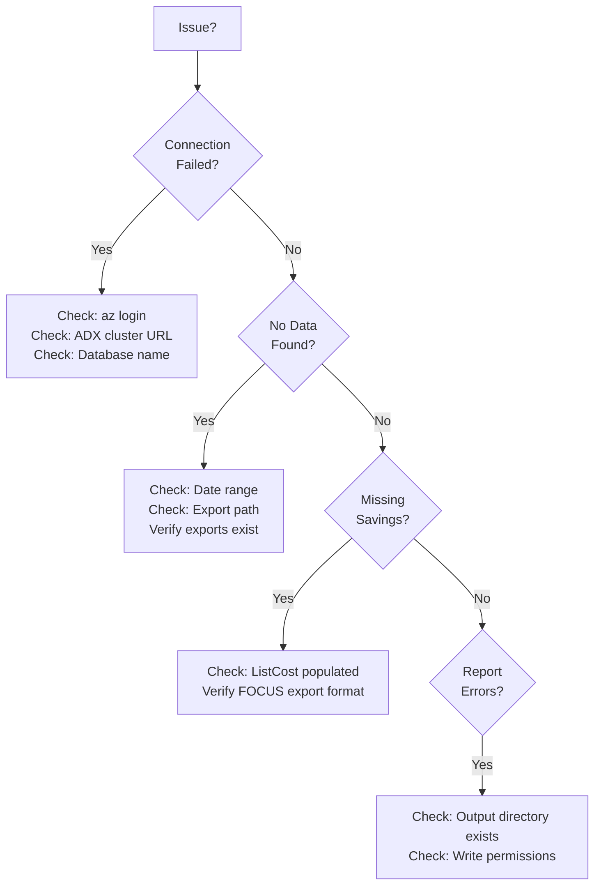
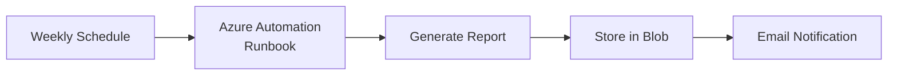

# Azure Savings Realization Report - User Guide

## Table of Contents

1. [Introduction](#introduction)
2. [Prerequisites](#prerequisites)
3. [Installation](#installation)
4. [Configuration](#configuration)
5. [Usage](#usage)
6. [Understanding the Report](#understanding-the-report)
7. [Troubleshooting](#troubleshooting)
8. [Advanced Usage](#advanced-usage)

---

## Introduction

### What This Tool Does

The Azure Savings Realization Report Generator creates comprehensive reports that show customers exactly how much they're saving on Azure through:



### Why Use This Tool?

| Without This Tool | With This Tool |
|-------------------|----------------|
| Manually gather data from 5+ portal views | Single command generates complete report |
| Spreadsheet calculations prone to errors | Automated, consistent calculations |
| Hours to prepare customer presentation | Minutes to generate professional report |
| No historical trend analysis | Built-in monthly trend charts |

---

## Prerequisites

### Required Access



### Check Your Setup

```powershell
# Check Python version
python --version  # Should be 3.9 or higher

# Check Azure CLI
az --version

# Verify you're logged in
az account show
```

---

## Installation

### Step 1: Clone or Download

```powershell
# Navigate to your preferred directory
cd c:\coderepo

# If using git
git clone <repository-url>
cd azure-savings-report

# Or download and extract the ZIP file
```

### Step 2: Install Dependencies

```powershell
# Create virtual environment (recommended)
python -m venv venv
.\venv\Scripts\Activate.ps1

# Install required packages
pip install -r requirements.txt
```

### Step 3: Verify Installation

```powershell
python generate_report.py --help
```

You should see:

```
Usage: generate_report.py [OPTIONS] COMMAND [ARGS]...

  Generate comprehensive Azure savings reports for customers

Options:
  --help  Show this message and exit.

Commands:
  generate           Generate a savings report for a customer
  list-subscriptions List subscriptions with cost data
  test-connection    Test the connection to the configured data source
```

---

## Configuration

### Step 1: Create Configuration File

```powershell
# Copy the example configuration
Copy-Item config.example.yaml config.yaml
```

### Step 2: Configure Your Data Source

Open `config.yaml` in your editor and update the settings:



#### For ADX (FinOps Hub) - Recommended

```yaml
data_source:
  type: "adx"
  
  adx:
    cluster_uri: "https://your-finops-hub.eastus.kusto.windows.net"
    database: "finopshub"
    costs_table: "Costs"
    prices_table: "Prices"
```

#### For Storage Exports

```yaml
data_source:
  type: "storage"
  
  storage:
    account_name: "mystorageaccount"
    container_name: "exports"
    export_path: "focuscost/subscriptions/00000000-0000-0000-0000-000000000000"
```

### Step 3: Configure Report Settings

```yaml
report:
  customer_name: "Contoso Corporation"
  months: 3
  output_dir: "./reports"
  currency: "USD"
  
  formats:
    - html
    - excel
```

---

## Usage

### Basic Usage



#### 1. Test Your Connection

```powershell
python generate_report.py test-connection
```

Expected output:
```
Testing data source connection...
✓ Connection successful!
  Data source type: adx
  Cluster: https://your-cluster.kusto.windows.net
  Database: finopshub
```

#### 2. Generate a Report

```powershell
# Basic usage - uses config.yaml settings
python generate_report.py generate

# Override customer name
python generate_report.py generate --customer "Contoso Corporation"

# Specify time period
python generate_report.py generate --months 6

# Full options
python generate_report.py generate \
    --customer "Contoso Corporation" \
    --months 3 \
    --output "./customer-reports" \
    --format all
```

#### 3. View Available Subscriptions

```powershell
python generate_report.py list-subscriptions --months 1
```

### Command Reference

| Command | Description | Key Options |
|---------|-------------|-------------|
| `generate` | Generate savings report | `--customer`, `--months`, `--output`, `--format` |
| `test-connection` | Verify data source connectivity | `--config` |
| `list-subscriptions` | Show subscriptions with cost data | `--months` |

### Output Files

After running `generate`, you'll find:

```
reports/
├── savings_report_Contoso_Corporation_20251204.html  # Interactive HTML report
└── savings_report_Contoso_Corporation_20251204.xlsx  # Excel workbook
```

---

## Understanding the Report

### Report Sections



### Understanding Savings Categories

#### Negotiated Discount
- **What it is**: The difference between Azure retail (list) prices and your EA/MCA contracted prices
- **How it's calculated**: `ListCost - BilledCost`
- **Example**: Retail price is $100/month, your EA price is $85/month → $15 savings

#### Reserved Instances (RI)
- **What it is**: Savings from 1-year or 3-year compute reservations
- **How it's calculated**: Usage covered by RI at discounted rate vs on-demand
- **Typical savings**: 30-72% depending on term and payment option

#### Savings Plans
- **What it is**: Flexible compute savings with hourly commitment
- **How it's calculated**: Spend covered by savings plan vs on-demand pricing
- **Typical savings**: Up to 65% on compute

#### Azure Hybrid Benefit (AHB)
- **What it is**: Using existing Windows Server or SQL Server licenses on Azure
- **How it's calculated**: Cost with AHB vs cost without (license included)
- **Typical savings**: Up to 40% on Windows VMs, up to 55% on SQL

#### Dev/Test Pricing
- **What it is**: Reduced rates for development and testing workloads
- **How it's calculated**: Dev/Test subscription pricing vs production pricing
- **Typical savings**: No Windows licensing costs, reduced rates on services

### Sample Report Interpretation

```
┌────────────────────────────────────────────────────────┐
│  Executive Summary                                      │
├────────────────────────────────────────────────────────┤
│  Retail Cost:      $1,250,000                          │
│  Effective Cost:   $875,000                            │
│  Total Savings:    $375,000 (30% savings)              │
├────────────────────────────────────────────────────────┤
│  Savings Breakdown:                                     │
│  ├─ Negotiated Discount:  $125,000  (33%)              │
│  ├─ Reserved Instances:   $150,000  (40%)              │
│  ├─ Savings Plans:        $50,000   (13%)              │
│  ├─ Azure Hybrid Benefit: $40,000   (11%)              │
│  └─ Dev/Test Pricing:     $10,000   (3%)               │
└────────────────────────────────────────────────────────┘
```

**How to present this to a customer:**

> "Over the past 3 months, your Azure investments have delivered $375,000 in savings - that's 30% less than you would have paid at retail pricing. The largest contributor is your Reserved Instances, saving $150,000, followed by your EA negotiated rates saving $125,000."

---

## Troubleshooting

### Common Issues



### Detailed Troubleshooting

#### "Connection Failed" Error

```powershell
# 1. Verify Azure login
az login

# 2. Check you can access the ADX cluster
az kusto database show \
    --cluster-name "your-cluster" \
    --database-name "finopshub" \
    --resource-group "your-rg"

# 3. Verify you have permissions
# You need at least "Database Viewer" role on the ADX database
```

#### "No Cost Data Found" Warning

1. **Check your date range**: Cost data may not be available for very recent dates
2. **Verify exports exist**: Check the FinOps Hub storage account
3. **Check scope**: Ensure you have access to the billing scope

```powershell
# List available data in ADX
# Run this KQL query in ADX Web UI
Costs
| summarize min(ChargePeriodStart), max(ChargePeriodEnd)
```

#### "ListCost is Zero" - Estimated Savings

If `ListCost` isn't populated in your data, the tool will estimate certain savings. This happens when:
- Using older export formats
- Price sheet data isn't available
- Certain charge types don't have retail pricing

---

## Advanced Usage

### Using KQL Queries Directly

The tool includes pre-built KQL queries in `src/kql_queries.py`. You can run these directly in ADX:

```python
from src.kql_queries import QUERIES, format_query

# Get the savings summary query
query = format_query(QUERIES['savings_summary'], '2025-09-01', '2025-12-01')
print(query)
```

### Creating Custom Reports

```python
from datetime import datetime, timedelta
from src import create_data_source, SavingsCalculator, ReportGenerator
import yaml

# Load config
with open('config.yaml') as f:
    config = yaml.safe_load(f)

# Create data source
ds = create_data_source(config)

# Get costs
end_date = datetime.now()
start_date = end_date - timedelta(days=90)
costs_df = ds.get_costs(start_date, end_date)

# Calculate savings
calc = SavingsCalculator(costs_df)
report = calc.generate_report("Custom Report", start_date, end_date)

# Access specific data
print(f"Total Savings: ${report.total_savings:,.2f}")
print(f"RI Savings: ${report.reserved_instance_savings.total_savings:,.2f}")

# Get savings by service as DataFrame
services_df = report.savings_by_service
print(services_df.head(10))
```

### Automating Report Generation

#### Using Azure Automation



#### Sample Automation Script

```python
# automation_wrapper.py
import os
from datetime import datetime
from azure.storage.blob import BlobServiceClient

def main():
    # Generate report
    os.system('python generate_report.py generate --customer "Contoso" --months 1')
    
    # Upload to blob storage
    blob_service = BlobServiceClient.from_connection_string(os.environ['STORAGE_CONNECTION'])
    container = blob_service.get_container_client('reports')
    
    report_name = f"savings_report_{datetime.now().strftime('%Y%m%d')}.html"
    with open(f'reports/{report_name}', 'rb') as f:
        container.upload_blob(report_name, f, overwrite=True)

if __name__ == '__main__':
    main()
```

### Using the ADX Dashboard

Import the queries from `dashboards/adx_dashboard.kql` into Azure Data Explorer to create an interactive dashboard:

1. Open Azure Data Explorer Web UI
2. Go to Dashboards → New Dashboard
3. Add tiles using the provided KQL queries
4. Customize date range parameters

---

## Getting Help

### Support Resources

- **GitHub Issues**: Report bugs or request features
- **Documentation**: Check `docs/ARCHITECTURE.md` for technical details
- **KQL Reference**: See `src/kql_queries.py` for query examples

### Providing Feedback

We welcome contributions! Please:
1. Open an issue describing the enhancement
2. Submit a pull request with your changes
3. Include tests for new functionality
